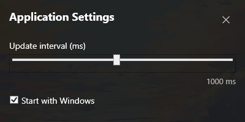
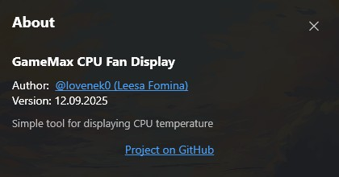

### [ENGLISH](README.md) | [RUSSIAN](README-RU.md)

# GameMax CPU Fan Display

**GameMax CPU Fan Display** — a C# WPF application for displaying CPU temperature on the cooler display.  

- Author: [**@lovenek0**](https://github.com/lovenek0)  
- Version: **12.09.2025**

```

Tested only with GameMax Gamma 90 Digital WH.
Support for other coolers is not guaranteed.

```

---

## ⚙️ Installation & Run
1. Download the [latest release](https://github.com/lovenek0/gamemax-cpu-fan-display/releases).
2. Extract the archive to any folder.
3. Run `GameMax CPU Fan Display.exe`.
4. To enable autostart, check the **Start with Windows** option in settings.

---

## 🛠️ Technologies
- **.NET 10.0 (Windows only)**
- **WPF (XAML + C#)**

---

## 📸 Screenshots
### Settings
Settings window with update interval slider and autostart checkbox.



### About
Window with project info, version, and GitHub link.



---

## 📜 License
MIT License — free to use, modify, and distribute.
